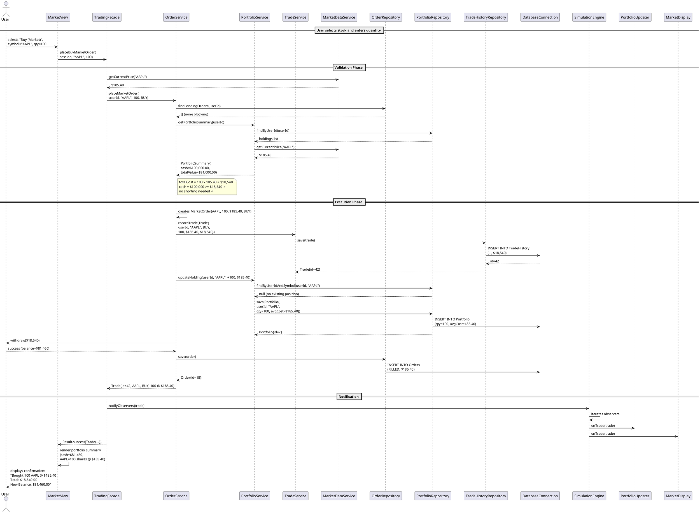
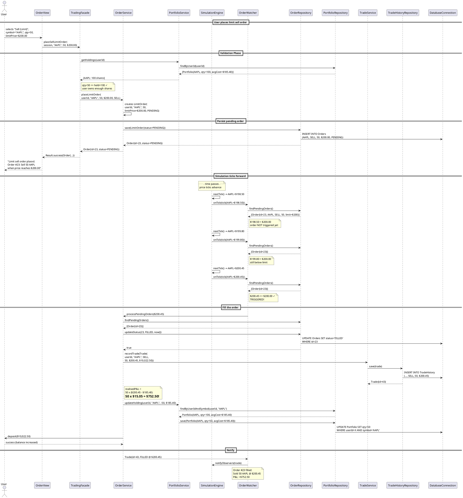

# Software Architecture Document

## Stock Trading Simulator

| **Field**        | **Details**                                      |
| ---------------- | ------------------------------------------------ |
| **Project Name** | Stock Trading Simulator                          |
| **Version**      | 1.0                                              |
| **Author**       | —                                                |
| **Course**       | Object-Oriented Programming (University Project) |
| **Date**         | July 2026                                        |

---

## Table of Contents

1. [Package Structure](#1-package-structure)
2. [Layer Architecture & Dependency Flow](#2-layer-architecture--dependency-flow)
3. [Class Hierarchy](#3-class-hierarchy)
4. [Interface Design](#4-interface-design)
5. [UML Class Diagram](#5-uml-class-diagram)
6. [Sequence Diagrams](#6-sequence-diagrams)
7. [Design Pattern Mapping](#7-design-pattern-mapping)
8. [SOLID Justification](#8-solid-justification)
9. [Key Dependency Relationships](#9-key-dependency-relationships)
10. [Data Flow Overview](#10-data-flow-overview)

---

## 1. Package Structure

```
com.stocktrader
│
├── model                          # Domain entities (pure POJOs)
│   ├── account
│   │   ├── User.java
│   │   └── Portfolio.java
│   ├── order
│   │   ├── Order.java              (abstract)
│   │   ├── MarketOrder.java
│   │   ├── LimitOrder.java
│   │   └── OrderStatus.java       (enum)
│   ├── stock
│   │   ├── Stock.java             (abstract)
│   │   └── EquityStock.java
│   ├── trade
│   │   ├── Trade.java
│   │   └── TradeType.java         (enum: BUY, SELL)
│   └── simulation
│       └── SimulationTick.java
│
├── repository                      # Persistence abstraction layer
│   ├── UserRepository.java         (interface)
│   ├── PortfolioRepository.java    (interface)
│   ├── OrderRepository.java        (interface)
│   ├── TradeHistoryRepository.java (interface)
│   ├── DataSourceFactory.java      (factory for repository creation)
│   └── sqlite                      # Concrete implementations
│       ├── SqliteUserRepository.java
│       ├── SqlitePortfolioRepository.java
│       ├── SqliteOrderRepository.java
│       ├── SqliteTradeHistoryRepository.java
│       └── DatabaseConnection.java  (Singleton)
│
├── service                         # Business logic layer
│   ├── UserService.java
│   ├── PortfolioService.java
│   ├── OrderService.java
│   ├── TradeService.java
│   └── MarketDataService.java
│
├── engine                          # Simulation engine
│   ├── SimulationEngine.java       (Singleton)
│   ├── SimulationClock.java         (interface)
│   ├── SimulationClockImpl.java
│   ├── PriceSimulationStrategy.java (interface)
│   ├── ForwardSimulation.java
│   ├── HistoricalNavigation.java
│   └── CsvPriceLoader.java
│
├── pattern                         # Design pattern infrastructure
│   ├── command
│   │   ├── Command.java            (interface)
│   │   ├── BuyOrderCommand.java
│   │   ├── SellOrderCommand.java
│   │   ├── CancelOrderCommand.java
│   │   ├── ExportHistoryCommand.java
│   │   └── CommandHistory.java
│   ├── observer
│   │   ├── TradeObserver.java      (interface)
│   │   ├── PortfolioUpdater.java
│   │   ├── OrderWatcher.java
│   │   └── MarketDisplay.java
│   ├── factory
│   │   ├── OrderFactory.java
│   │   └── ViewFactory.java
│   └── strategy
│       └── ReportExporter.java     (interface)
│           ├── CsvExporter.java
│           └── JsonExporter.java
│
├── facade                          # Unified entry point
│   └── TradingFacade.java
│
└── ui                              # Presentation layer
    ├── MainMenu.java
    ├── Session.java
    └── view
        ├── View.java               (abstract — Template Method)
        ├── DashboardView.java
        ├── PortfolioView.java
        ├── OrderView.java
        ├── MarketView.java
        ├── TradeHistoryView.java
        └── SimulationControlView.java
```

---

## 2. Layer Architecture & Dependency Flow

```
┌─────────────────────────────────────────────────────────────┐
│                         UI LAYER                             │
│  MainMenu, Session, View* classes                            │
│  (depends only on Facade)                                    │
└───────────────────────┬─────────────────────────────────────┘
                        │  calls
                        ▼
┌─────────────────────────────────────────────────────────────┐
│                      FACADE LAYER                            │
│  TradingFacade                                               │
│  (orchestrates services + engine, exposes simplified API)    │
└──────┬─────────────────────────┬────────────────────────────┘
       │                         │
       ▼                         ▼
┌──────────────┐      ┌──────────────────────┐
│ SERVICE LAYER│      │   ENGINE LAYER        │
│ UserService  │      │ SimulationEngine      │
│ PortfolioSvc │      │ PriceSimulationStrat  │
│ OrderService │◄────►│ SimulationClock       │
│ TradeService │      │ CsvPriceLoader        │
│ MarketDataSvc│      └──────────────────────┘
└──────┬───────┘
       │  depends on
       ▼
┌─────────────────────────────────────────────────────────────┐
│                   REPOSITORY LAYER                           │
│  (interfaces) UserRepo / PortfolioRepo / OrderRepo /         │
│               TradeHistoryRepo                                │
│                       │                                       │
│               (concrete)                                      │
│  SqliteUserRepo / SqlitePortfolioRepo / SqliteOrderRepo /     │
│  SqliteTradeHistoryRepo / DatabaseConnection                  │
└─────────────────────────────────────────────────────────────┘
       │
       ▼
┌─────────────────────────────────────────────────────────────┐
│                       MODEL LAYER                            │
│  User, Portfolio, Order, MarketOrder, LimitOrder,            │
│  Stock, EquityStock, Trade, SimulationTick, enums            │
└─────────────────────────────────────────────────────────────┘
```

**Dependency Rule:** Dependencies point inward. The UI layer depends only on the Facade. The Facade depends on Services and the Engine. Services depend on Repository interfaces — never on concrete SQLite implementations. The Model layer has zero dependencies on other layers.

---

## 3. Class Hierarchy

### 3.1 Order Hierarchy (Inheritance + Polymorphism)

```
┌───────────────────────────┐
│  <<abstract>>             │
│  Order                    │
│───────────────────────────│
│ - id: long                │
│ - userId: long            │
│ - symbol: String          │
│ - quantity: int           │
│ - price: BigDecimal       │
│ - status: OrderStatus     │
│ - createdAt: LocalDateTime│
│ - filledAt: LocalDateTime │
│───────────────────────────│
│ + getId(): long           │
│ + getUserId(): long       │
│ + getSymbol(): String     │
│ + getQuantity(): int      │
│ + getPrice(): BigDecimal  │
│ + getStatus(): OrderStatus│
│───────────────────────────│
│ + <<abstract>>            │
│   validate(): void        │
│ + <<abstract>>            │
│   execute(OrderContext):  │
│   Trade                   │
│ + cancel(): void          │
└──────────┬────────────────┘
           │ extends
     ┌─────┴─────┐
     ▼           ▼
┌──────────┐ ┌──────────┐
│MarketOrder│ │LimitOrder│
│──────────│ │──────────│
│ (no extra│ │ - limit- │
│  fields) │ │ Price:   │
│          │ │ BigDecimal│
│──────────│ │──────────│
│ validate │ │ validate │
│ (instant │ │ (deferred│
│  fill)   │ │  fill)   │
│ execute  │ │ execute  │
│ (immed-  │ │ (wait for│
│ iate at  │ │  price   │
│ current  │ │  match)  │
│ price)   │ │          │
└──────────┘ └──────────┘
```

### 3.2 Stock Hierarchy

```
┌───────────────────────────┐
│  <<abstract>>             │
│  Stock                    │
│───────────────────────────│
│ - symbol: String          │
│ - companyName: String     │
│ - sector: String          │
│ - priceHistory: List<Price>│
│───────────────────────────│
│ + getSymbol(): String     │
│ + getCurrentPrice(): Price│
│ + <<abstract>>            │
│   getAssetType(): String  │
└──────────┬────────────────┘
           │ extends
           ▼
┌───────────────────────────┐
│  EquityStock              │
│───────────────────────────│
│ - marketCap: long         │
│ - sharesOutstanding: long │
│───────────────────────────│
│ + getAssetType(): String  │
│   returns "EQUITY"        │
└───────────────────────────┘
```

### 3.3 View Hierarchy (Template Method)

```
┌───────────────────────────────┐
│  <<abstract>>                 │
│  View                         │
│───────────────────────────────│
│ # title: String               │
│ # session: Session            │
│───────────────────────────────│
│ + render(): void              │  ← TEMPLATE METHOD
│ # <<abstract>>                │
│   renderHeader(): void        │
│ # <<abstract>>                │
│   renderBody(): void          │
│ # <<abstract>>                │
│   renderFooter(): void        │
│ # readUserInput(): String     │
└───────────┬───────────────────┘
            │ extends
    ┌───────┼───────┬──────────┐
    ▼       ▼       ▼          ▼
┌──────┐ ┌──────┐ ┌──────┐ ┌──────────┐
│Port- │ │Order │ │Market│ │TradeHist- │
│folio │ │View  │ │View  │ │oryView   │
│View  │ │      │ │      │ │          │
└──────┘ └──────┘ └──────┘ └──────────┘
```

### 3.4 Command Hierarchy

```
┌───────────────────────────┐
│  <<interface>>            │
│  Command                  │
│───────────────────────────│
│ + execute(): void         │
│ + undo(): void            │
│ + getDescription(): String│
└───────────┬───────────────┘
            │ implements
    ┌───────┼───────┬──────────┐
    ▼       ▼       ▼          ▼
┌──────┐ ┌──────┐ ┌────────┐ ┌──────────┐
│Buy   │ │Sell  │ │Cancel  │ │Export    │
│Order │ │Order │ │Order   │ │History   │
│Cmd   │ │Cmd   │ │Cmd     │ │Cmd       │
└──────┘ └──────┘ └────────┘ └──────────┘
```

### 3.5 Observer Hierarchy

```
┌───────────────────────────┐
│  <<interface>>            │
│  TradeObserver            │
│───────────────────────────│
│ + onTick(SimulationTick): │
│   void                    │
│ + onTrade(Trade): void    │
│ + onOrderStatusChange(    │
│   Order): void            │
└───────────┬───────────────┘
            │ implements
    ┌───────┼──────────────┐
    ▼       ▼              ▼
┌────────┐ ┌──────────┐ ┌───────────┐
│Port-   │ │Order     │ │Market     │
│folio   │ │Watcher   │ │Display    │
│Updater │ │          │ │           │
└────────┘ └──────────┘ └───────────┘
```

---

## 4. Interface Design

### 4.1 Repository Interfaces

```java
// ── UserRepository ──────────────────────────────────────────
interface UserRepository {
    Optional<User> findById(long id);
    Optional<User> findByUsername(String username);
    User save(User user);                         // create or update
    boolean deleteById(long id);
    boolean existsByUsername(String username);
}

// ── PortfolioRepository ─────────────────────────────────────
interface PortfolioRepository {
    List<Portfolio> findByUserId(long userId);
    Optional<Portfolio> findByUserIdAndSymbol(long userId, String symbol);
    Portfolio save(Portfolio portfolio);           // upsert
    boolean deleteByUserIdAndSymbol(long userId, String symbol);
    void deleteByUserId(long userId);
}

// ── OrderRepository ─────────────────────────────────────────
interface OrderRepository {
    Optional<Order> findById(long id);
    List<Order> findByUserId(long userId);
    List<Order> findByUserIdAndStatus(long userId, OrderStatus status);
    List<Order> findPendingOrders();               // engine polls these
    Order save(Order order);                       // create or update status
    boolean updateStatus(long orderId, OrderStatus newStatus, LocalDateTime filledAt);
}

// ── TradeHistoryRepository ──────────────────────────────────
interface TradeHistoryRepository {
    List<Trade> findByUserId(long userId);
    List<Trade> findByUserIdAndSymbol(long userId, String symbol);
    Trade save(Trade trade);
    List<Trade> findByDateRange(long userId, LocalDate from, LocalDate to);
}
```

### 4.2 Engine Interfaces

```java
// ── PriceSimulationStrategy ─────────────────────────────────
interface PriceSimulationStrategy {
    boolean hasNext();
    SimulationTick next();
    SimulationTick getCurrentTick();
    void jumpToDate(LocalDate date);
    void reset();
    String getModeName();                          // "Forward" or "Historical"
}

// ── SimulationClock ─────────────────────────────────────────
interface SimulationClock {
    void start();
    void pause();
    void resume();
    void stop();
    void setSpeedMultiplier(int multiplier);       // 1x, 2x, 5x, 10x
    boolean isRunning();
    int getSpeedMultiplier();
    long getTicksElapsed();
}
```

### 4.3 Pattern Interfaces

```java
// ── Command ─────────────────────────────────────────────────
interface Command {
    void execute();
    void undo();
    String getDescription();
}

// ── TradeObserver ───────────────────────────────────────────
interface TradeObserver {
    void onTick(SimulationTick tick);
    void onTrade(Trade trade);
    void onOrderStatusChange(Order order);
}

// ── ReportExporter ──────────────────────────────────────────
interface ReportExporter {
    void export(List<Trade> trades, OutputStream out) throws IOException;
    String getFormatName();                        // "CSV", "JSON"
}
```

### 4.4 Service Interfaces

```java
// ── OrderService ────────────────────────────────────────────
interface OrderService {
    Trade placeMarketOrder(long userId, String symbol, int quantity, TradeType type);
    Order placeLimitOrder(long userId, String symbol, int quantity,
                          BigDecimal limitPrice, TradeType type);
    boolean cancelOrder(long orderId);
    List<Order> getUserOrders(long userId);
    List<Order> getUserPendingOrders(long userId);
    void processPendingOrders(BigDecimal currentPrice); // called on each tick
}

// ── PortfolioService ────────────────────────────────────────
interface PortfolioService {
    PortfolioSummary getPortfolioSummary(long userId);
    List<Portfolio> getHoldings(long userId);
    BigDecimal getTotalValue(long userId);
    BigDecimal getUnrealisedPnl(long userId);
}

// ── MarketDataService ───────────────────────────────────────
interface MarketDataService {
    List<Stock> getAvailableStocks();
    Optional<Stock> getStock(String symbol);
    BigDecimal getCurrentPrice(String symbol);
    List<SimulationTick> getPriceHistory(String symbol, int limit);
}
```

---

## 5. UML Class Diagram

```plantuml
@startuml
skinparam style strictuml
skinparam backgroundColor #FEFEFE
skinparam classFontColor #111111
skinparam classBorderColor #333333
skinparam classBackgroundColor #F5F5F5
skinparam arrowColor #333333
skinparam packageStyle rectangle

package "com.stocktrader.model" as MODEL {
  package "account" {
    class User {
      - id : long
      - username : String
      - passwordHash : String
      - cashBalance : BigDecimal
      - createdAt : LocalDateTime
      + getId() : long
      + getUsername() : String
      + getCashBalance() : BigDecimal
      + deposit(amount : BigDecimal) : void
      + withdraw(amount : BigDecimal) : boolean
    }
    class Portfolio {
      - id : long
      - userId : long
      - symbol : String
      - quantity : int
      - averageCost : BigDecimal
      - lastUpdated : LocalDateTime
      + getTotalValue(currentPrice : BigDecimal) : BigDecimal
      + getUnrealizedPnl(currentPrice : BigDecimal) : BigDecimal
      + addShares(qty : int, price : BigDecimal) : void
      + removeShares(qty : int) : boolean
    }
  }
  package "order" {
    abstract class Order {
      - id : long
      - userId : long
      - symbol : String
      - quantity : int
      - price : BigDecimal
      - status : OrderStatus
      - createdAt : LocalDateTime
      - filledAt : LocalDateTime
      + {abstract} validate() : void
      + {abstract} execute(ctx : OrderContext) : Trade
      + cancel() : void
    }
    class MarketOrder {
      + validate() : void
      + execute(ctx : OrderContext) : Trade
    }
    class LimitOrder {
      - limitPrice : BigDecimal
      + getLimitPrice() : BigDecimal
      + validate() : void
      + execute(ctx : OrderContext) : Trade
    }
    enum OrderStatus {
      PENDING
      FILLED
      CANCELLED
    }
  }
  package "stock" {
    abstract class Stock {
      - symbol : String
      - companyName : String
      - sector : String
      + {abstract} getAssetType() : String
    }
    class EquityStock {
      - marketCap : long
      + getAssetType() : String
    }
  }
  package "trade" {
    class Trade {
      - id : long
      - userId : long
      - symbol : String
      - tradeType : TradeType
      - quantity : int
      - price : BigDecimal
      - totalValue : BigDecimal
      - tradeDate : LocalDateTime
    }
    enum TradeType {
      BUY
      SELL
    }
  }
  package "simulation" {
    class SimulationTick {
      - symbol : String
      - date : LocalDate
      - open : BigDecimal
      - high : BigDecimal
      - low : BigDecimal
      - close : BigDecimal
      - volume : long
    }
  }
}

package "com.stocktrader.repository" as REPO {
  interface UserRepository {
    + findById(id : long) : Optional<User>
    + findByUsername(username : String) : Optional<User>
    + save(user : User) : User
    + existsByUsername(username : String) : boolean
  }
  interface PortfolioRepository {
    + findByUserId(userId : long) : List<Portfolio>
    + findByUserIdAndSymbol(userId : long, symbol : String) : Optional<Portfolio>
    + save(portfolio : Portfolio) : Portfolio
  }
  interface OrderRepository {
    + findById(id : long) : Optional<Order>
    + findByUserId(userId : long) : List<Order>
    + findPendingOrders() : List<Order>
    + save(order : Order) : Order
    + updateStatus(id : long, status : OrderStatus, filledAt : LocalDateTime) : boolean
  }
  interface TradeHistoryRepository {
    + findByUserId(userId : long) : List<Trade>
    + save(trade : Trade) : Trade
  }
  class DataSourceFactory {
    + {static} createUserRepository() : UserRepository
    + {static} createPortfolioRepository() : PortfolioRepository
    + {static} createOrderRepository() : OrderRepository
    + {static} createTradeHistoryRepository() : TradeHistoryRepository
  }
  package "sqlite" {
    class DatabaseConnection {
      - instance : DatabaseConnection
      - connection : Connection
      + {static} getInstance() : DatabaseConnection
      + getConnection() : Connection
    }
    class SqliteUserRepository
    class SqlitePortfolioRepository
    class SqliteOrderRepository
    class SqliteTradeHistoryRepository
  }
}

package "com.stocktrader.service" as SERVICE {
  class UserService {
    - userRepo : UserRepository
    + register(username : String, password : String) : User
    + login(username : String, password : String) : Optional<User>
    + getBalance(userId : long) : BigDecimal
  }
  class PortfolioService {
    - portfolioRepo : PortfolioRepository
    + getHoldings(userId : long) : List<Portfolio>
    + getTotalValue(userId : long) : BigDecimal
    + getUnrealizedPnl(userId : long) : BigDecimal
    + updateHolding(userId : long, symbol : String, qty : int, price : BigDecimal) : void
  }
  class OrderService {
    - orderRepo : OrderRepository
    - portfolioService : PortfolioService
    + placeMarketOrder(userId : long, symbol : String, qty : int, type : TradeType) : Trade
    + placeLimitOrder(userId : long, symbol : String, qty : int, limitPrice : BigDecimal, type : TradeType) : Order
    + cancelOrder(orderId : long) : boolean
    + processPendingOrders(currentPrice : BigDecimal) : void
  }
  class TradeService {
    - tradeRepo : TradeHistoryRepository
    + recordTrade(trade : Trade) : Trade
    + getTradeHistory(userId : long) : List<Trade>
  }
  class MarketDataService {
    - stocks : Map<String, Stock>
    + loadFromCsv(directory : String) : void
    + getAvailableStocks() : List<Stock>
    + getCurrentPrice(symbol : String) : BigDecimal
  }
}

package "com.stocktrader.engine" as ENGINE {
  class SimulationEngine {
    - instance : SimulationEngine
    - clock : SimulationClock
    - strategy : PriceSimulationStrategy
    - observers : List<TradeObserver>
    + {static} getInstance() : SimulationEngine
    + setStrategy(strategy : PriceSimulationStrategy) : void
    + registerObserver(observer : TradeObserver) : void
    + removeObserver(observer : TradeObserver) : void
    + notifyObservers(tick : SimulationTick) : void
    + start() : void
    + pause() : void
    + resume() : void
  }
  interface SimulationClock {
    + start() : void
    + pause() : void
    + resume() : void
    + setSpeedMultiplier(multiplier : int) : void
    + isRunning() : boolean
  }
  class SimulationClockImpl
  interface PriceSimulationStrategy {
    + hasNext() : boolean
    + next() : SimulationTick
    + getCurrentTick() : SimulationTick
    + jumpToDate(date : LocalDate) : void
  }
  class ForwardSimulation
  class HistoricalNavigation
  class CsvPriceLoader {
    + {static} loadFromCsv(filePath : String) : List<SimulationTick>
  }
}

package "com.stocktrader.pattern" as PATTERN {
  package "command" {
    interface Command {
      + execute() : void
      + undo() : void
      + getDescription() : String
    }
    class BuyOrderCommand
    class SellOrderCommand
    class CancelOrderCommand
    class ExportHistoryCommand
    class CommandHistory {
      - history : Deque<Command>
      + push(cmd : Command) : void
      + undo() : void
      + getHistory() : List<Command>
    }
  }
  package "observer" {
    interface TradeObserver {
      + onTick(tick : SimulationTick) : void
      + onTrade(trade : Trade) : void
      + onOrderStatusChange(order : Order) : void
    }
    class PortfolioUpdater
    class OrderWatcher
    class MarketDisplay
  }
  package "factory" {
    class OrderFactory {
      + {static} createOrder(type : OrderType, params : Map) : Order
    }
    class ViewFactory {
      + {static} createView(viewType : ViewType) : View
    }
  }
  package "strategy" {
    interface ReportExporter {
      + export(trades : List<Trade>, out : OutputStream) : void
    }
    class CsvExporter
    class JsonExporter
  }
}

package "com.stocktrader.facade" as FACADE {
  class TradingFacade {
    - userService : UserService
    - portfolioService : PortfolioService
    - orderService : OrderService
    - tradeService : TradeService
    - marketDataService : MarketDataService
    - engine : SimulationEngine
    + registerUser(username : String, password : String) : Result<User>
    + loginUser(username : String, password : String) : Result<Session>
    + getDashboard(session : Session) : DashboardData
    + placeBuyMarketOrder(session : Session, symbol : String, qty : int) : Result<Trade>
    + placeSellMarketOrder(session : Session, symbol : String, qty : int) : Result<Trade>
    + placeBuyLimitOrder(session : Session, symbol : String, qty : int, limitPrice : BigDecimal) : Result<Order>
    + placeSellLimitOrder(session : Session, symbol : String, qty : int, limitPrice : BigDecimal) : Result<Order>
    + cancelOrder(session : Session, orderId : long) : Result<Void>
    + getPortfolio(session : Session) : PortfolioSummary
    + getTradeHistory(session : Session) : List<Trade>
    + getMarketData() : List<Stock>
    + exportTrades(session : Session, exporter : ReportExporter) : void
    + setSimulationSpeed(multiplier : int) : void
    + pauseSimulation() : void
    + resumeSimulation() : void
  }
}

package "com.stocktrader.ui" as UI {
  class MainMenu
  class Session {
    - user : User
    - loggedInAt : LocalDateTime
    + getUser() : User
    + isActive() : boolean
  }
  package "view" {
    abstract class View {
      # session : Session
      + render() : void
      # {abstract} renderHeader() : void
      # {abstract} renderBody() : void
      # {abstract} renderFooter() : void
    }
    class DashboardView
    class PortfolioView
    class OrderView
    class MarketView
    class TradeHistoryView
    class SimulationControlView
  }
}

' ── Relationships ──────────────────────────────────────────

' Inheritance
MarketOrder --|> Order
LimitOrder --|> Order
EquityStock --|> Stock
ForwardSimulation ..|> PriceSimulationStrategy
HistoricalNavigation ..|> PriceSimulationStrategy
SimulationClockImpl ..|> SimulationClock
DashboardView --|> View
PortfolioView --|> View
OrderView --|> View
MarketView --|> View
TradeHistoryView --|> View
SimulationControlView --|> View

' Interface implementation
SqliteUserRepository ..|> UserRepository
SqlitePortfolioRepository ..|> PortfolioRepository
SqliteOrderRepository ..|> OrderRepository
SqliteTradeHistoryRepository ..|> TradeHistoryRepository
BuyOrderCommand ..|> Command
SellOrderCommand ..|> Command
CancelOrderCommand ..|> Command
ExportHistoryCommand ..|> Command
PortfolioUpdater ..|> TradeObserver
OrderWatcher ..|> TradeObserver
MarketDisplay ..|> TradeObserver
CsvExporter ..|> ReportExporter
JsonExporter ..|> ReportExporter

' Composition / Aggregation
SimulationEngine o-- SimulationClock
SimulationEngine o-- PriceSimulationStrategy
SimulationEngine o-- TradeObserver : notifies
CommandHistory o-- Command
TradingFacade o-- UserService
TradingFacade o-- PortfolioService
TradingFacade o-- OrderService
TradingFacade o-- TradeService
TradingFacade o-- MarketDataService
TradingFacade o-- SimulationEngine

' Dependencies
OrderService --> PortfolioService : uses
OrderService --> OrderRepository : depends on
OrderService --> TradeHistoryRepository : depends on
UserService --> UserRepository : depends on
PortfolioService --> PortfolioRepository : depends on
TradeService --> TradeHistoryRepository : depends on
MarketDataService --> CsvPriceLoader : uses
DataSourceFactory --> SqliteUserRepository : creates
DataSourceFactory --> SqlitePortfolioRepository : creates
DataSourceFactory --> SqliteOrderRepository : creates
DataSourceFactory --> SqliteTradeHistoryRepository : creates
Order ..> OrderContext : <<use>>
View --> TradingFacade : calls
MainMenu --> TradingFacade : calls
MainMenu --> Session : creates

@enduml
```



---

## 6. Sequence Diagrams

### 6.1 Market Buy Order



### 6.2 Limit Sell Order



---

## 7. Design Pattern Mapping

| **Pattern** | **Location** | **Intent** | **Participants** |
|---|---|---|---|
| **Singleton** | `SimulationEngine`, `DatabaseConnection` | Ensure a single simulation state and a single database connection per JVM. | `SimulationEngine` / `DatabaseConnection` (self) |
| **Factory Method** | `OrderFactory`, `ViewFactory`, `DataSourceFactory` | Delegate object creation to subclasses or static methods; client code does not know concrete types. | `Product`: `Order`, `View`, Repository interfaces<br>`ConcreteProduct`: `MarketOrder`, `LimitOrder`, `PortfolioView`, etc. |
| **Abstract Factory** | `DataSourceFactory` | Creates families of related repository objects without specifying concrete classes. | `AbstractFactory`: `DataSourceFactory`<br>`ConcreteFactory`: returns `SqliteUserRepo`, `SqlitePortfolioRepo`, etc. |
| **Strategy** | `PriceSimulationStrategy`, `ReportExporter` | Encapsulate interchangeable algorithms behind a common interface. | `Context`: `SimulationEngine` / CLI<br>`Strategy`: `PriceSimulationStrategy` / `ReportExporter`<br>`ConcreteStrategy`: `ForwardSimulation`, `HistoricalNavigation` / `CsvExporter`, `JsonExporter` |
| **Observer** | `SimulationEngine` + `TradeObserver` | Allow one-to-many notification when simulation state changes (ticks, trades, order fills). | `Subject`: `SimulationEngine`<br>`Observer`: `TradeObserver`<br>`ConcreteObserver`: `PortfolioUpdater`, `OrderWatcher`, `MarketDisplay` |
| **Template Method** | `View.render()` | Define the skeleton of an algorithm in a base class, deferring steps to subclasses. | `AbstractClass`: `View` with `render()` calling `renderHeader()`, `renderBody()`, `renderFooter()`<br>`ConcreteClass`: `PortfolioView`, `OrderView`, `MarketView`, etc. |
| **Command** | `Command` interface + implementations | Encapsulate a request as an object, parameterizing clients with different requests, queue or log requests, and support undoable operations. | `Command`: `Command` interface<br>`ConcreteCommand`: `BuyOrderCommand`, `SellOrderCommand`, `CancelOrderCommand`, `ExportHistoryCommand`<br>`Invoker`: CLI menu `MainMenu`<br>`Receiver`: `TradingFacade`<br>`Client`: `MainMenu` |
| **Facade** | `TradingFacade` | Provide a unified, simplified interface to a set of interfaces in a subsystem. | `Facade`: `TradingFacade`<br>`Subsystem classes`: `UserService`, `PortfolioService`, `OrderService`, `TradeService`, `MarketDataService`, `SimulationEngine` |
| **Repository** | `UserRepository`, `PortfolioRepository`, `OrderRepository`, `TradeHistoryRepository` | Mediate between the domain and data mapping layers, acting like an in-memory domain object collection. | `Repository`: interfaces<br>`ConcreteRepository`: SQLite implementations<br>`Client`: Services |
| **MVC (Architectural)** | `model` / `service` + `facade` / `ui.view` | Separate concerns into Model (data), View (presentation), and Controller (logic). | `Model`: `model` package + `repository` package<br>`View`: `ui.view` package<br>`Controller`: `facade.TradingFacade` + `service` package |

---

## 8. SOLID Justification

### S — Single Responsibility Principle

Every class in the architecture has exactly one reason to change:

| Class | Responsibility |
|---|---|
| `UserService` | Manages user registration and authentication only |
| `PortfolioService` | Calculates portfolio summaries and manages holdings |
| `OrderService` | Handles order creation, validation, and execution |
| `TradeService` | Records and retrieves completed trade history |
| `MarketDataService` | Loads and provides access to stock price data |
| `SimulationEngine` | Drives the simulation clock and notifies observers |
| `OrderWatcher` | Monitors pending orders against current prices |
| `OrderRepository` (interface) | Defines contract for order persistence |
| `SqliteOrderRepository` | Implements order persistence for SQLite |
| `TradingFacade` | Orchestrates cross-service workflows |

A class like `PortfolioService` does not also handle order validation or database connections. Changes to pricing logic do not affect user authentication code.

### O — Open/Closed Principle

The system is **open for extension, closed for modification**:

- **New order types** (`StopOrder`, `StopLimitOrder`) extend the abstract `Order` class and implement `execute()` — no changes to `OrderService` or `TradingFacade` are required.
- **New simulation modes** implement `PriceSimulationStrategy` — `SimulationEngine` works with any strategy through the interface.
- **New export formats** implement `ReportExporter` (`CsvExporter`, `JsonExporter`, and future `PdfExporter` or `ExcelExporter`) — no changes to the reporting UI.
- **New views** extend `View` and implement `renderHeader()`, `renderBody()`, `renderFooter()` — the main menu loop calls `view.render()` polymorphically without modification.
- **New data sources** (e.g., PostgreSQL, in-memory test doubles) implement the repository interfaces — existing services that depend on those interfaces are untouched.

### L — Liskov Substitution Principle

Any subtype can replace its base type without altering correctness:

- `MarketOrder` and `LimitOrder` are fully substitutable for `Order`. The `OrderService` accepts `Order`, calls `order.validate()` then `order.execute(ctx)`, and both subtypes fulfil the contract correctly. `MarketOrder` fills instantly; `LimitOrder` creates a pending record. Neither violates preconditions or postconditions.
- `ForwardSimulation` and `HistoricalNavigation` are substitutable for `PriceSimulationStrategy`. Both implement `next()`, `hasNext()`, `jumpToDate()`, and `getCurrentTick()` with consistent semantics.
- `CsvExporter` and `JsonExporter` are substitutable for `ReportExporter`. The caller receives `List<Trade>` and an `OutputStream`, and either implementation writes valid output without side effects.

The `Order` base class enforces the invariant that `price` and `quantity` must be positive, and both `MarketOrder` and `LimitOrder` respect it.

### I — Interface Segregation Principle

Interfaces are narrow and focused on specific client needs:

- `UserRepository` exposes only user-specific methods (`findByUsername`, `save`, `existsByUsername`) — no portfolsio or order methods.
- `PortfolioRepository` exposes only portfolio-specific methods (`findByUserId`, `findByUserIdAndSymbol`, `save`).
- `OrderRepository` exposes only order-specific methods (`findPendingOrders`, `updateStatus`, `save`).
- `TradeObserver` defines only `onTick()`, `onTrade()`, and `onOrderStatusChange()` — a class that only observes trades is not forced to implement unrelated methods.

There is no monolithic `DataAccess` interface that forces all clients to depend on methods they do not use.

### D — Dependency Inversion Principle

High-level modules do not depend on low-level modules; both depend on abstractions:

```
┌─────────────────────────────────────────────────────┐
│                   HIGH-LEVEL                         │
│  OrderService  PortfolioService  TradingFacade       │
│       │               │              │               │
│       ▼               ▼              ▼               │
│  OrderRepository  PortfolioRepo  SimulationEngine    │
│  (interface)      (interface)    (uses interfaces)   │
│       ▲               ▲              ▲               │
│       │               │              │               │
│  SqliteOrderRepo  SqlitePortfolioRepo  ForwardSim    │
│  (concrete)       (concrete)          (concrete)     │
│                   LOW-LEVEL                           │
└─────────────────────────────────────────────────────┘
```

- `OrderService` depends on `OrderRepository` (interface), not on `SqliteOrderRepository`. The concrete implementation is injected via `DataSourceFactory` or constructor injection.
- `PortfolioService` depends on `PortfolioRepository` (interface), not on SQLite or JDBC.
- `TradingFacade` depends on service interfaces, not on concrete service classes.
- `SimulationEngine` depends on `PriceSimulationStrategy` and `SimulationClock` (both interfaces), not on their concrete implementations.

This makes every layer testable: unit tests inject mock repository implementations or in-memory test doubles without needing a database.

---

## 9. Key Dependency Relationships

### 9.1 Constructor Injection Map

The following shows what each class receives via constructor injection (or factory):

```
TradingFacade
  ├── UserService(UserRepository)
  ├── PortfolioService(PortfolioRepository)
  ├── OrderService(OrderRepository, PortfolioService, TradeService)
  │     └── TradeService(TradeHistoryRepository)
  ├── MarketDataService(CsvPriceLoader)
  └── SimulationEngine(SimulationClock, PriceSimulationStrategy)

View (subclasses)
  └── TradingFacade  (passed at construction)
```

### 9.2 Runtime Object Graph (typical session)

```
MainMenu
  └── TradingFacade
        ├── UserService ──────────> SqliteUserRepository ──> DatabaseConnection
        ├── PortfolioService ─────> SqlitePortfolioRepo ───> DatabaseConnection
        ├── OrderService ─────────> SqliteOrderRepo ───────> DatabaseConnection
        │               ─────────> SqliteTradeHistoryRepo ─> DatabaseConnection
        │               ─────────> PortfolioService (shared)
        ├── TradeService ─────────> SqliteTradeHistoryRepo ─> DatabaseConnection
        ├── MarketDataService ────> CsvPriceLoader
        └── SimulationEngine (Singleton)
              ├── SimulationClockImpl
              ├── ForwardSimulation  (or HistoricalNavigation)
              └── List<TradeObserver>
                    ├── PortfolioUpdater
                    ├── OrderWatcher ──> OrderService
                    └── MarketDisplay
```

### 9.3 Package Dependency Rules

| Package | May Depend On | Must Not Depend On |
|---|---|---|
| `model` | Java standard library | Any other package |
| `repository` | `model` | `service`, `engine`, `ui`, `facade` |
| `service` | `model`, `repository` | `engine`, `ui`, `facade` |
| `engine` | `model`, `pattern.observer` | `repository`, `ui`, `facade` |
| `pattern` | `model`, `service` (selective) | `ui`, `facade` |
| `facade` | all except `ui` | `ui` |
| `ui` | `model`, `facade` | `service`, `repository`, `engine` (direct) |

---

## 10. Data Flow Overview

### 10.1 UI → Facade → Service → Repository Flow

```
User Input (CLI)
    │
    ▼
MainMenu / View
    │  calls TradingFacade.placeBuyMarketOrder(session, "AAPL", 100)
    ▼
TradingFacade
    │  1. Delegates to OrderService
    │  2. Validates session validity
    │  3. Wraps result in Result<T> (success/failure)
    ▼
OrderService
    │  1. Validates order (cash, shares)
    │  2. Calls PortfolioService for balance check
    │  3. Creates MarketOrder / LimitOrder via OrderFactory
    │  4. Calls TradeService.recordTrade()
    │  5. Calls PortfolioService.updateHolding()
    │  6. Persists via OrderRepository.save()
    ▼
Repository (interface)
    │
    ▼
SqliteOrderRepository  (concrete implementation)
    │  Translates domain object to SQL
    ▼
DatabaseConnection (Singleton)
    │  Provides java.sql.Connection
    ▼
SQLite file (stock_trading.db)
```

### 10.2 Engine Tick Flow

```
SimulationClock (timer thread)
    │  fires at configured interval
    ▼
SimulationEngine
    │  1. Reads next tick from PriceSimulationStrategy
    │  2. Updates current price map
    │  3. Notifies all TradeObserver instances
    ▼
PortfolioUpdater    OrderWatcher             MarketDisplay
    │                   │                         │
    │                   ▼                         │
    │               OrderService                  │
    │               processPendingOrders()         │
    │                   │                         │
    │              ┌────┴────┐                     │
    │              │         │                     │
    │          fills     still pending             │
    │          order     (no match)                │
    │              │                               │
    │              ▼                               │
    │     TradeService.recordTrade()               │
    │     PortfolioService.updateHolding()         │
    ▼                                              ▼
updates portfolio                    updates on-screen prices
in-memory cache                      (or CLI display refresh)
```

---

*End of Architecture Document*
